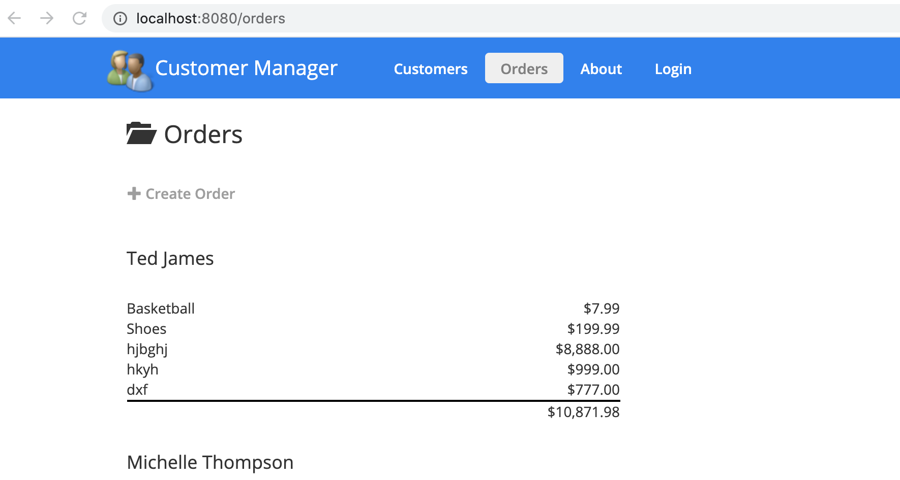
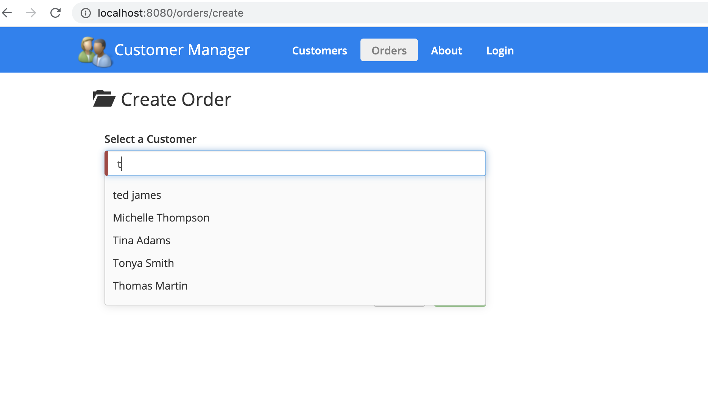
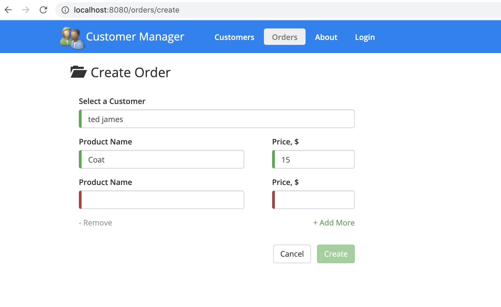
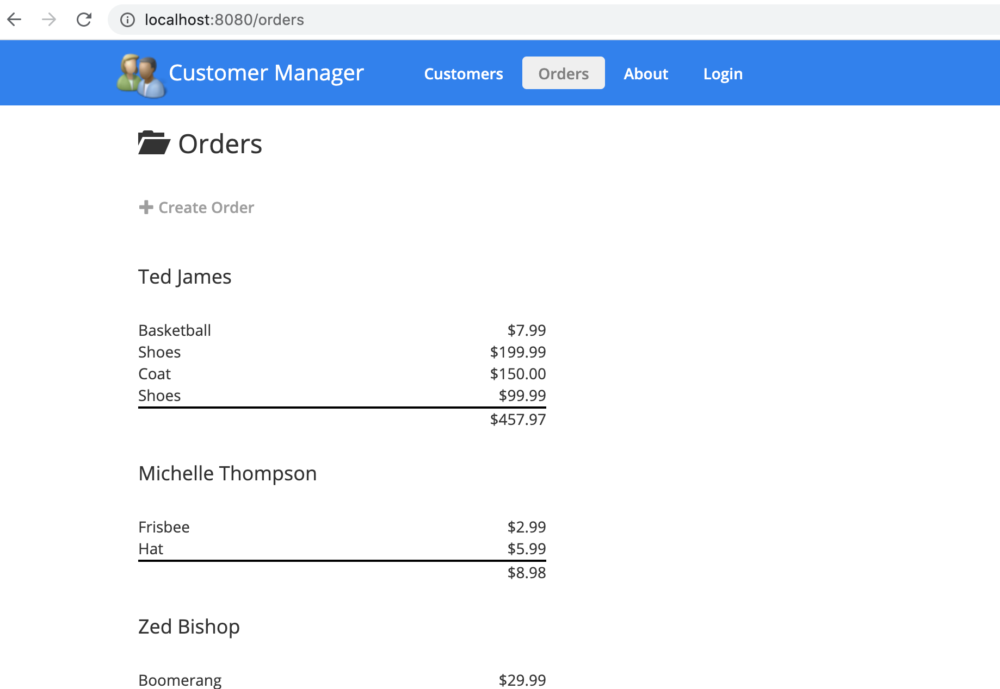

## Running the Application with Node.js

1. Install the latest LTS version of Node.js from https://nodejs.org. *IMPORTANT: The server uses ES2015 features AND the Angular CLI so you need a current version of Node.js.*

1. Run `npm install` to install app dependencies

1. Run `ng build --watch` to build and bundle the code

1. Run `npm start` in a separate terminal window to build the TypeScript, watch for changes and launch the web server

1. Go to http://localhost:8080 in your browser 

## 'Create New Order' feature

1. Navigate to Orders view

1. Click 'Create Order' button

1. In 'Create Order' view start typing customer name and select one from autocomplete menu

1. Fill product name and price. By pressing 'Add More' you can add more products.
 You can add up to 5 products in one order. All the fields are mandatory. 'Remove' button  
 deletes the last added set of fields.

1. After the form is filled correctly, press 'Create' button to add an order.
The order will be added to the customer orders and can be found in Orders view.

